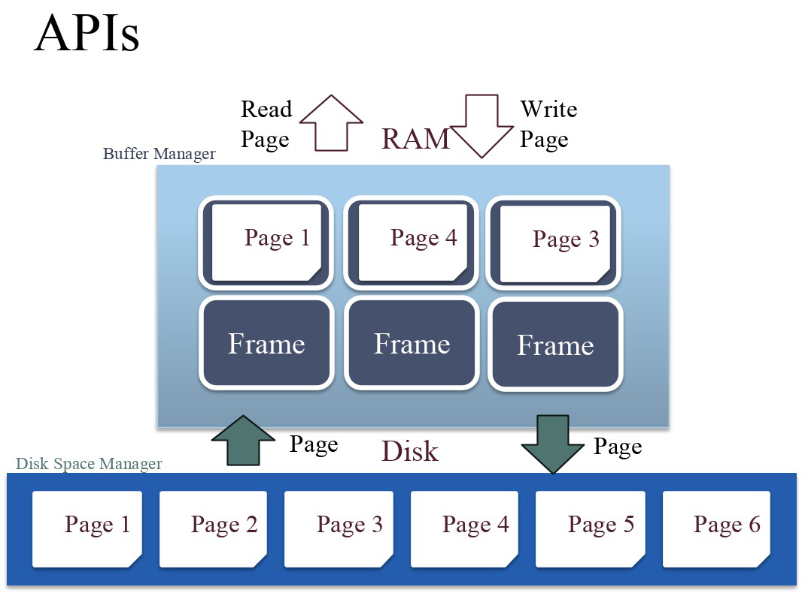
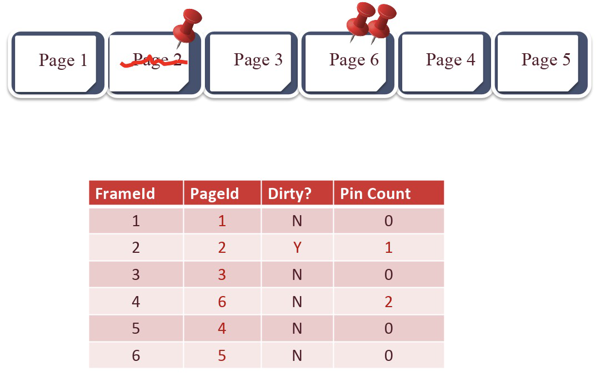
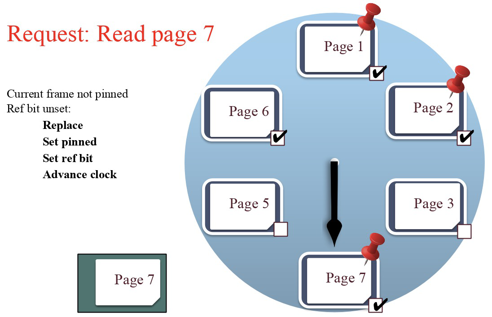

# DataBase Management Syatem Overview

## DBMS Architecture
client: SQL.  
server: Database Management System.  

#### Database Management System Modules
* Query Parsing & Oprators: Parse, check and verify SQL legal. Translate into an efficient relational query plan.  
* Relational Operators: There are individual algorithms put together to execute a dataflow.  
* Files and Index Management: Organiza tables and Records as groups of pages in a logical file.  
* Buffer Management: Map disk block to system memory(RAM).  
* Disk Space Management: Map pages to locations on disk.   
  - [x] Provides API to read/write a page in device.  
  - [x] Provides 'next' locality and abstract FS/device details.  
  
## Disk Space Management
**NOTE**: There is **no pointer dereference**. Instead using an API:  
* READ: transfer "page" of data from disk to RAM.   
* WRITE: transfer "page" of data from RAM to disk.  
  

  

#### Components of a disk
* Only one head reads/writes at any one time.  
* Block = Unit of transfer for disk read/write. Block/page size is a multiple of (fixed) sector size.  

#### Accessing a Disk page
* seek time: movine arms to position disk head on track.  
* rotational delay: waiting for block to rotate under head.  
* transfer time: actually moving data to/from disk surface.  
**Note**: key to I/O cost: reduce seek/rotational delays.  

### Database Files
* **DB File**: A collection of pages, each containing a collection of records.  
* API for DBMS:  
  - [x] Insert/Delete/Modify record.  
  - [x] Fetch a particular record by **record id** (pageID, location on page).  
  - [x] Scan all records.  
* Types of DB Files: Unordered Heap Files/Clustered Heap Files/Sorted Files/Index Files.  
  
#### Heap File Organization
* Page Directory + Data Page  

  

#### Page Organization

  

* Footer(like header for page)
  - [x] Pointer to free space
  - [x] Record ID + Pointer to beginning of record  

## Files and Index Management

#### Multiple File Organizations
* Heap Files: Suitable when typical access is a full scan of all records.  
* Sorted Files: Best for retrieval in order, or when range of records is needed.  
* Clustered Files & Indexes: Group data into blocks to enable fast look up and efficient modifications.  

#### Cost Model 

  

* B: The number od data blocks in the file.  
* R: Number of records per block.  
* D: Average time to read/write disk block.  

  

#### From Heap Files to Index Files
* Heap Files: look up things by recordId(PageId + slotId).   
* Index Files: look up things by value.  

  

#### Clustered VS Unclustered Index Heap Files

  

* F: Average internal node fanout.  
* E: Average #data entries per half.  

|                   | Heap File   | Sorted File       | Clustered Index     |
| ----------------- | :---------- | ---------------:  | :----------------:  |
| Scan all records  | B*D         | B*D               | 3/2B*D              |
| Equality Search   | 1/2*B*D     |(lg2B)*D           | (lgF(BR/E)+2)*D     |
| Rnage Search      | B*D         | ((lg2B)+pages)*D  | (lgF(BR/E)+3*pages)*D  |
| Insert            | 2*D         | ((lg2B)+B)*D      | (lgF(BR/E)+3)*D     |
| Delete            | (0.5*B+1)*D | ((lg2B)+B)*D      | (lgF(BR/E)+3)*D     |

* Height of Clustered Index: lgF(BR/E). BR: #of records. E: records per leaf. BR/E: #of leafs.   
* Range Search: 2/3 pages full.

## Buffer Management
* Memory is converted into a buffer pool by partitioning the space into frames that pages can be placed in.  
* The buffer pool is responsible for moving physical pages back and forth from main memory to disk.  

  

* Buffer Manager metadata:  
  - [x] **Frame ID** that is uniquely associated with a memory address.  
  - [x] **Page ID** for determining which page a frame currently contains.  
  - [x] **Dirty Bit** for verifying whether or not a page has been modified.  
  - [x] **Pin Count** for tracking the number of requestors currently using a page.(let buffer manager know if a page in use)      

  

##### When a page is requested
* If reauested page is not in pool:
  - [x] Choose an **un-pinned** frame for replacement.  
  - [x] If frame "dirty", write current page to disk, makr "clean".  
  - [x] Read requested page into frame.  

* Pin the page and return its address.  

##### After Requestor Finishes
* Requestor of page must:  
  - [x] Set dirty if page was modified.  
  - [x] Unpin the page.  
* Page in pool may be requested many times:
  - [x] To pin a page: pin_count++.    
  - [x] A page is a candidate for replacement if pin_count == 0.  

##### Page Replacement Policy
* Least-recently-used(LRU) - good for random access      
  - [x] LRU: add Last used column. Find min Last used(priority heap).  

  

* Clock:  
  - [x] clock hand - point to next page to consider.     
  - [x] Ref bit: represent recently referenced pages.  

  * Iterate through frames within the table, skipping pinned pages and wrapping around to frame 0 upon reaching the end, until the first unpinned frame with ref bit = 0 is found.    
  * During each iteration, if the current frame’s ref bit = 1, decrement the ref bit to 0 and move the clock hand to the next frame.    
  * Upon reaching a frame with ref bit = 0, evict the existing page, read in the new page, set the frame’s ref bit to 1, and move the clock hand to the next frame.    

* Most-recently-used(MRU) - good for repeated sequential  