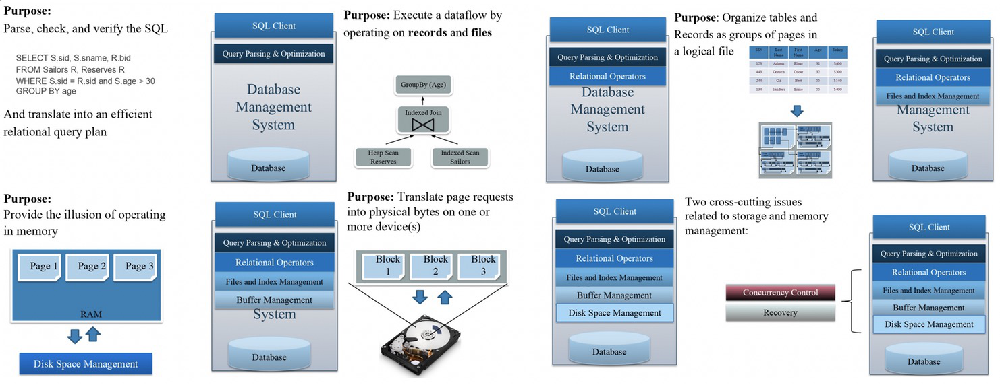
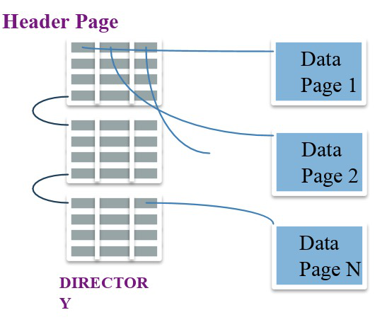
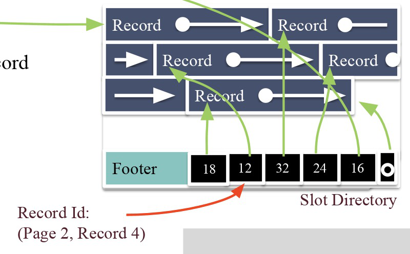

# Disk Representation 

## DBMS Architecture
client: SQL.  
server: Database Management System.  

#### Database Management System Modules
* Query Parsing & Oprators: Parse, check and verify SQL legal. Translate into an efficient relational query plan.  
* Relational Operators: There are individual algorithms put together to execute a dataflow.  
* Files and Index Management: Organiza tables and Records as groups of pages in a logical file.  
* Buffer Management: Map disk block to system memory(RAM).  
* Disk Space Management: Map pages to locations on disk.   
  - [x] Provides API to read/write a page in device.  
  - [x] Provides 'next' locality and abstract FS/device details.  
  

## Disks
**NOTE**: There is **no pointer dereference**. Instead using an API:  
* READ: transfer "page" of data from disk to RAM.   
* WRITE: transfer "page" of data from RAM to disk.  
  

  

#### Components of a disk
* Only one head reads/writes at any one time.  
* Block = Unit of transfer for disk read/write. Block/page size is a multiple of (fixed) sector size.  

#### Accessing a Disk page
* seek time: movine arms to position disk head on track.  
* rotational delay: waiting for block to rotate under head.  
* transfer time: actually moving data to/from disk surface.  
**Note**: key to I/O cost: reduce seek/rotational delays.  

## Database Files
* **DB File**: A collection of pages, each containing a collection of records.  
* API for DBMS:  
  - [x] Insert/Delete/Modify record.  
  - [x] Fetch a particular record by **record id** (pageID, location on page).  
  - [x] Scan all records.  
* Types of DB Files: Unordered Heap Files/Clustered Heap Files/Sorted Files/Index Files.  
  
#### Heap File Organization
* Page Directory + Data Page  

  

#### Page Organization

  

* Footer(like header for page)
  - [x] Pointer to free space
  - [x] Record ID + Pointer to beginning of record