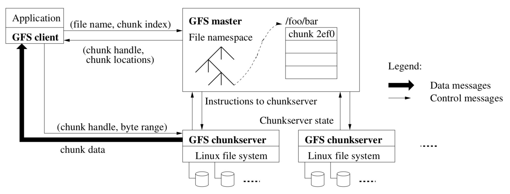

# GFS: Google File System  

## Consistency  
#### Why is distributed storage hard?  
* high performance -> shard data over many servers.  
* many servers -> constant faults.  
* fault tolerance -> replication.  
* replication -> potential inconsistencies.  
* better consistency -> low performance.  

### Consistency Concept 
* Same behavior as a single server, server executes client operations one at a time (even if concurrent).  
* Reads reflect previous writes even if server crashes and restarts.  

#### Example of Strong Consistency Model  
* suppose C1 and C2 write concurrently, and after the writes have completed, C3 and C4 read. what can they see?  
```go
    C1: Wx1
    C2: Wx2
    C3:     Rx?
    C4:         Rx?
```
* Answer: either 1 or 2, but both have to see the same value. This is consistency.  
* Disadvantage: single server has poor fault-tolerance.  

#### Example of Fault-Tolerance  
```go
//two replica servers, S1 and S2
    //clients send writes to both, in parallel
    //clients send reads to either
    C1: S1->Wx1
    C2: S2->Wx2
    C3:         Rx->S1? see x=1
    C4:         Rx->S2? see x=2
``` 
* Tradeoffs possible between performance and consistency: better consistency usually requires communication to ensure the replicas stay in sync -- can be slow!  

## GFS

#### Overall Structure  

<div align=center>
  
</div>

* clients (library, RPC -- but not visible as a UNIX FS)  
* each file split into independent 64 MB chunks  
  * chunk servers, each chunk replicated on 3  
  * every file's chunks are spread over the chunk servers  
    * for parallel read/write (e.g. MapReduce), and to allow huge files  
  * single master (!), and master replicas  
  * division of work: master deals w/ naming, chunkservers w/ data  


  

