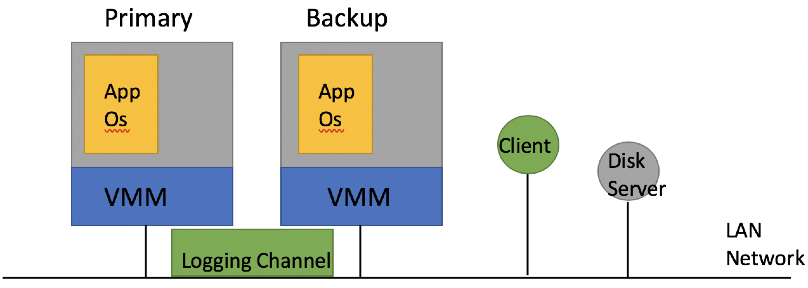

# Primary-Backup Replication

* Failures  
  * can handle - fail-stop faults
    * fan stops working, CPU overheats and shuts itself down  
    * someone trips over replica's power cord or network cable  
    * software notices it is out of disk space and stops  
  * can not handle - bugs  
  
### Two main replication approaches
#### State Transfer - memory   
* Primary replica executes the service  
* Primary sends [new] state to backups  

#### Replicated State Machine  
* Clients send operations to primary, primary sequences and sends to backups.  
*  All replicas execute all operations  
    * same start state,  
    * same operations,  
    * same order, deterministic,    
    * then same end state.  

* State transfer is simpler  
  * But state may be large, slow to transfer over network  

* Replicated state machine often generates less network traffic  
  * Operations are often small compared to state  
  * But complex to get right  
  * VM-FT uses replicated state machine   

#### Things to consider
* What state to replicate?    
* P/B sync (primary execute ahead of backup?)    
* Cut-over (P falis before B, switch over)
* Anomalies  
* New Replicas  

#### At what level do we want replicas to be identical?
* Application state, e.g. a database's tables?  
  * GFS works this way  
  * Can be efficient; primary only sends high-level operations to backup  
  * Application code (server) must understand fault tolerance, to e.g. forward op stream  
* Machine level, e.g. registers and RAM content?  
  * might allow us to replicate any existing server w/o modification!  
  * requires forwarding of machine events (interrupts, DMA, &c)  
  * requires "machine" modifications to send/recv event stream...  

## VMware FT  
#### Components  

  

* hypervisor == monitor == VMM (virtual machine monitor)  
* O/S+app is the "guest" running inside a virtual machine  
* two machines, primary and backup  
  * primary sends all external events (client packets &c) to backup over network
    "logging channel", carrying log entries  