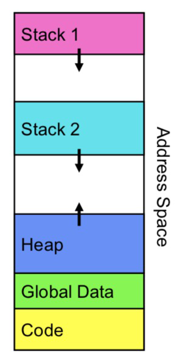

# Thread

## Thread Introduction
#### What is a thread?
* A sequential execution stream within process.   
  * Thread - Lightweight process. Multiple threads in one process share one address space.      
  * Process - Heavyweight process. A process have their own address space.  

#### Thread Vs Process
| Process                                    | Threads                                         | 
| ------------------------------------------ | :---------------------------------------------  | 
| More security is desired (eg.Chrome browser: more process - more tabs )   | Leverage the power of a multi-core system       | 
| Running into synchronization primitives     | Want communication simplified and cheaper      |  
| Don’t worry about race conditions     |  Switching between threads is cheaper than process  |
| One thread blocks in a task (say IO) then all threads block |   |

#### Thread State  

<div align=center>
  
</div>

* State shared by all threads in addr space  
  * Content of memory(global variables, heap).  
  * I/O state: file descriptors, network connnections, etc.  

* State "private" to each thread (all kept in TCB = Thread Control Block)    
  * CPU registers(program counter).  
  * Execution stack pointer.  

#### Multithread Programs
* Network Servers  
  * Concurrent requests from network: File Server, Web Server.  

## Pthread Functions

```c
int pthread_create(pthread_t *thread, const pthread_attr_t *attr,void *(*start_routine) (void *), void *arg);  
```
* The first is a pointer to a variable that will hold the id of the newly created thread.  
* The second is a pointer to attributes that we can use to tweak and tune some of the advanced features of pthreads.   
* The third is a pointer to a function that we want to run.  
* Fourth is a pointer that will be given to our function.  

```c
int pthread_join(pthread_t thread, void **retval);  
```
* The pthread_join() function waits for the thread to finish, clean up thread resources.     
* On success, pthread_join() returns 0. On error, it returns an error number.  
* If retval is not NULL, then the exit status of the target thread is placed in the location pointed to by retval.  

```c
void pthread_exit(void *retval);
```
* Stops the calling thread so the thread never returns after calling pthread_exit.  